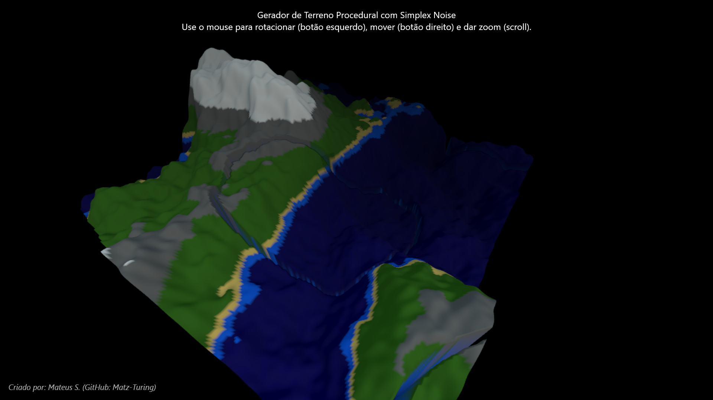

# Gerador de Terreno Procedural

  

Um gerador de mundo procedural 3D interativo. Ele utiliza camadas de Simplex Noise para criar terrenos detalhados com biomas, rios e elevações variadas, tudo renderizado em tempo real com a biblioteca Three.js.

[**Clique aqui para ver a demonstração**](https://procedural-terrain-gen.netlify.app/)  

##  Funcionalidades

-   **Geração de Terreno com Múltiplas Camadas (Octaves)**: Criação de relevo realista combinando várias frequências de ruído.
-   **Criação de Biomas por Altitude**: Coloração dinâmica do terreno que simula água, areia, grama, rocha e neve.
-   **Escultura de Rios Procedurais**: Um segundo algoritmo de ruído "cava" leitos de rios no terreno.
-   **Visualização 3D em Tempo Real**: Renderização fluida da cena usando WebGL através do Three.js.
-   **Iluminação Naturalista e Atmosfera**: Uso de `HemisphereLight` e névoa para criar uma iluminação ambiente e profundidade.
-   **Controles de Câmera Interativos**: Navegue pela cena com zoom, rotação e movimento (pan).

##  Tecnologias Utilizadas

-   **Three.js**: A biblioteca principal para renderização 3D no navegador.
-   **simplex-noise**: Biblioteca para geração de ruído Simplex, a base para a proceduralidade.
-   **HTML5, CSS3 e JavaScript (ESM)**: Estrutura, estilo e lógica do projeto, utilizando a sintaxe de Módulos ES.

##  Detalhes da Implementação

#### 1. Estrutura da Cena com Three.js
A base é uma cena padrão do Three.js com `Scene`, `PerspectiveCamera` e `WebGLRenderer`. O fundo e a névoa (`fog`) são definidos como pretos para criar uma atmosfera focada e de alto contraste. Os `OrbitControls` permitem a interação do usuário.

#### 2. Iluminação Atmosférica
Para evitar que o terreno fique completamente escuro no fundo preto, foi utilizada uma combinação de luzes:
-   **`HemisphereLight`**: Simula a luz ambiente de forma natural, com uma cor para a luz vinda do céu (azulada) e outra para a luz refletida pelo chão (terrosa). Isso garante que as sombras não sejam áreas de preto absoluto, revelando detalhes.
-   **`DirectionalLight`**: Atua como a fonte de luz principal (sol/lua), projetando sombras nítidas e realces no relevo.

#### 3. Geração de Elevação (Octaves / FBM)
O coração do gerador. Em vez de usar uma única chamada de ruído, o que resultaria em um relevo monótono, aplicamos a técnica de **Fractional Brownian Motion (FBM)**:
-   A altura de cada vértice é calculada somando várias "camadas" de ruído, chamadas de **octaves**.
-   A primeira camada usa uma baixa frequência para criar as formas gerais (grandes montanhas e vales).
-   Cada camada subsequente tem uma **frequência maior** (`lacunarity`) e uma **amplitude menor** (`persistence`).
-   Isso significa que adicionamos detalhes progressivamente mais finos (colinas, rochas, irregularidades) que têm menos impacto na altura geral, resultando em um terreno muito mais natural e detalhado.

#### 4. Criação de Rios
Um segundo gerador de ruído (`riverNoise2D`) é usado exclusivamente para os rios:
-   Calculamos o valor absoluto do ruído (`Math.abs(noise)`). Isso cria "vales" em forma de 'V' em vez de colinas e vales.
-   Se o valor do ruído para um ponto estiver abaixo de um limiar (`threshold`), consideramos que aquele ponto faz parte de um leito de rio.
-   A elevação nesse ponto é então reduzida para "cavar" o rio no terreno. A profundidade é suavizada nas margens para uma transição mais natural.

#### 5. Coloração de Biomas
Após calcular a altura final de cada vértice, uma simples cadeia de `if/else if` verifica essa altura contra níveis pré-definidos (`biome.levels`) e atribui a cor de um bioma correspondente (`biome.colors`). O material do terreno é configurado com `vertexColors: true` para que cada vértice possa exibir sua própria cor.

---

### Créditos

Criado por: **Mateus S. (GitHub: Matz-Turing)**
